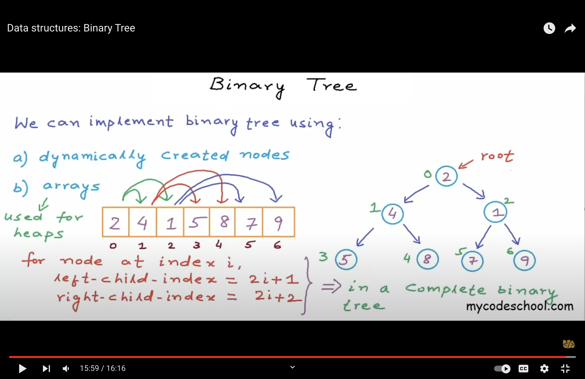
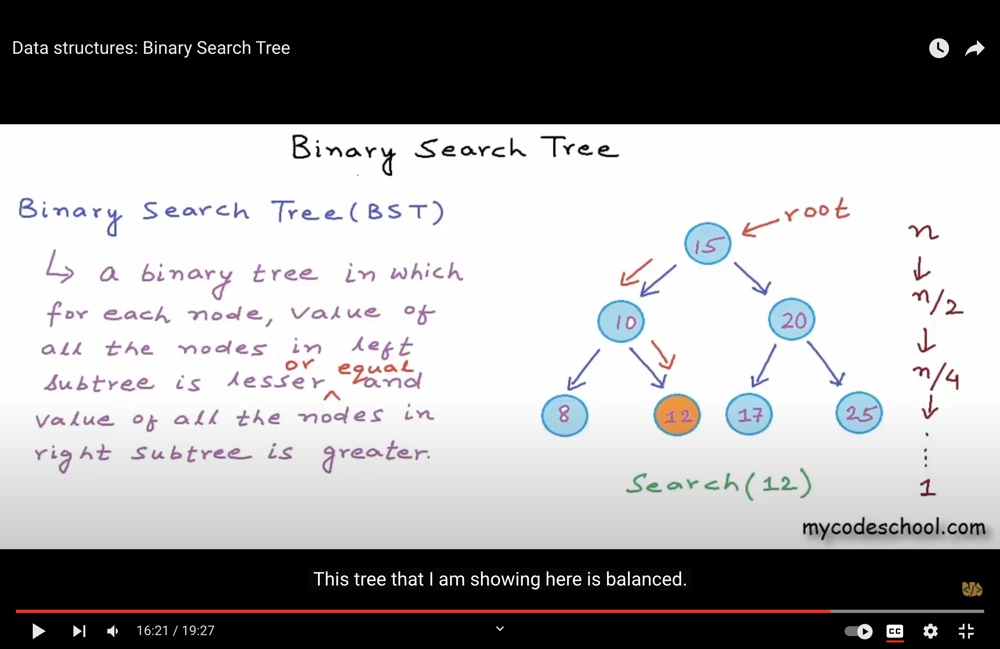
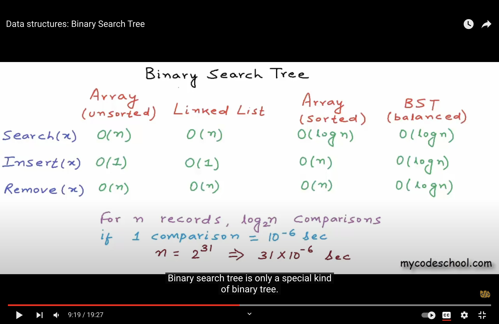

# what is a tree?

[Binary tree](https://www.youtube.com/watch?v=H5JubkIy_p8&ab_channel=mycodeschool)

- A tree is a data structure that is often used to represent hierarchical data.
  e.g .
    - How files and folders are organised.
    - Representing organization structure.

- The basic structure of a tree consists of the following components:

    - Nodes: Hold data
    - Root: The uppermost node of a tree
    - Parent Node: A node which is connected to one or more nodes on the lower level (Child Nodes).
    - Child Node: A node which is linked to an upper node (Parent Node)
    - Sibling Node: Nodes that have the same Parent Node
    - Leaf Node – A node that does not have any Child Node
    - Nodes are connected by edges. Each node contains a value or data, and it may or may not have a child node
- Terminology Used in Trees
    - Sub-tree: A subtree is a portion of a tree that can be viewed as a complete tree on its own. Any node in a tree,
      together with all the connected nodes below it, comprise a subtree of the original tree. Think of the sub-tree as
      an analogy for the term, proper subset.
    - Degree:The degree of a node refers to the total number of sub-trees of a node

    - Depth:The number of connections (edges) from the root to a node is known as the depth of that node.
    - Level: (DepthOfNode)+1
    - Height of a Node:The maximum number of connections between the node and a leaf node in its path is known as the
      height of that node.
    - Height of a Tree:The height of a tree is simply the height of its root node. height of the tree == max depth of the tree
- I learned that depth and height are properties of a node:
    - The depth of a node is the number of edges from the node to the tree's root node.A root node will have a depth of
        0.
    - The height of a node is the number of edges on the longest path from the node to a leaf. A leaf node will have a
      height of 0.

- Some properties of a tree:
    - The height of a tree would be the height of its root node,
      or equivalently, the depth of its deepest node (maximum depth).
    - The diameter (or width) of a tree is the number of nodes on the longest path between any two leaf nodes. The tree
      below has a diameter of 6 nodes.
       
       
      
       
       

- Types of Trees in Data Structure
    - General Tree: each node can have infinite number of children.
    - Binary tree:  each parent can have at most 2 children, right and left child. When certain constraints and
      properties are imposed on Binary tree it results in a number of other widely used trees like BST (Binary Search
      Tree), AVL tree, RBT tree etc.
    - Binary Search Tree: is an extension of Binary tree with some added constraints, In BST, the value of the left
      child of a node must be smaller than or equal to the value of its parent and the value of the right child is
      always larger than or equal to the value of its parent
    - AVL Tree: is a self-balancing binary search tree. The common operations like lookup, insertion and deletion takes
      O(log n) time in AVL tree. It is widely used for Lookup operations.The name AVL is given on the name of its
      inventors Adelson-Velshi and Landis. This was the first dynamically balancing tree. In AVL tree, each node is
      assigned a balancing factor based on which it is calculated whether the tree is balanced or not. In AVL tree, the
      heights of children of a node differ by at most 1. The valid balancing factor in AVL tree are 1, 0 and -1. When a
      new node is added to the AVL tree and tree becomes unbalanced then rotation is done to make sure that the tree
      remains balanced. The common operations like lookup, insertion and deletion takes O(log n) time in AVL tree. It is
      widely used for Lookup operations.
    - Red-Black Tree: is another type of self-balancing tree.The name Red-Black is given to it because each node in a
      Red-Black tree is either painted Red or Black according to the properties of the Red- Black Tree. This make sure
      that the tree remains balanced. Although the Red-Black tree is not a perfectly balanced tree but its properties
      ensure that the searching operation takes only O(log n) time. Whenever a new node is added to the Red-Black Tree,
      the nodes are rotated and painted again if needed to maintain the properties of the Red-Black Tree .
    - N-ary: In an N-ary tree, the maximum number of children that a node can have is limited to N. A binary tree is
      2-ary tree as each node in binary tree has at most 2 children. Trie data structure is one of the most commonly
      used implementation of N-ary tree. A full N-ary tree is a tree in which children of a node is either 0 or N. A
      complete N-ary tree is the tree in which all the leaf nodes are at the same level.
- binary search tree
    - General Tree: is an extension of Binary tree with some added constraints, In BST, the value of the left child of a
      node must be smaller than or equal to the value of its parent and the value of the right child is always larger
      than or equal to the value of its parent
    - Balanced/unbalanced - Algo ensures tree are balanced
    - Traversal:
        1. Inorder traversal left - then root - then right
        2. Preorder traversal - root - then left - then right
        3. Postorder traversal - left - then right - then root
        4. Level order traversal
    - Typically in binary search tree we want to do inorder traversal because
      that actually allows the nodes to be printed inorder.
- Binary tree - Each node can have at most 2 children.
    - strict/proper binary tree - Each node can have either 0 or 2 nodes
    - Complete binary tree - All levels except possibly the last are completely filled, and all nodes are as left as
      possible
        1. The maximum no of nodes at level i = 2^i. At level zero we have 2^0=1;
        2. Height of a complete binary tree is [log2n]. Integral part of log n to base 2. e.g. n= 15 = [3.906891] = 3
    - Perfect binary tree - All levels are completely filled.
        1. The maximum no of nodes in a binary tree with height h = 2^(h+1) - 1. h+1 = no of levels. Hence 2^(no of
           levels)-1;
           h in this case is the height of the tree and not node hence height == max depth
        2. What the height of a perfect binary tree with n nodes?
            - n = 2^(h+1) - 1
            - n+1 = 2^(h+1)
            - log2(n+1)-1 = h
            - h= log2(n+1)-1
            - e.g. h = log16 to base 2 -1 = 4-1=3
            - Hence since perfect binary tree is a complete tree it is also 3.
            - Time complexity for a perfect/Complete binary tree is O(h)-> h is the height of the tree.
              which is O(log2N). for a sparse tree is O(n). It's like having a linked list. Hence we want to keep binary
              tree balanced.
    - Balanced binary tree - Difference between height of the left & right subtree for every node is not more than k(
      mostly 1).
    - If a complete binary tree is represented in array, the following applies:
       
       
      
- Binary search tree - Binary tree in which, for each node,value of all the nodes
  in the left subtree is lesser than or equal and value of all the
  nodes in right subtree is greater.
- Duplicates are not allowed in binary search tree

  
   
   
  

- AVL tree
  AVL trees are a self-balanced special type of Binary Search Tree with just one exception:For each Node, the maximum height difference between the left and right sub-trees can only be one. 
- If at any point their difference becomes more than one, then re-balancing is applied to make it a valid AVL tree.
  - properties:
    - It is a bst
    - (balance factor)Height of the left subtree - height of the right subtree is [-1,0,1]
    - For each node, balance factor must be calculated
    - 

  

    
      